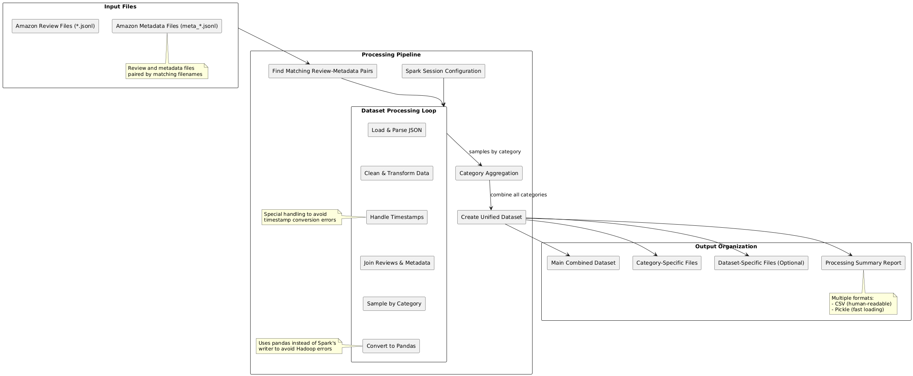

# Amazon Reviews Data Processor
A Databricks notebook suite for processing Amazon review datasets, handling various data formats and structures.

## Data Source
The data used in this project comes from the Amazon Reviews Dataset, available at:
https://amazon-reviews-2023.github.io/

This dataset contains product reviews and metadata from Amazon, spanning various product categories. The dataset is used for research purposes to analyze customer feedback, sentiment analysis, and product categorization.

## Architecture

*Diagram of the Amazon Unified Data Processing Pipeline*

## Features
- Data ingestion from JSONL files
- Cleaning and preprocessing
- Join operations and sampling
- Visualization of data quality
- Export functionality

## Notebooks

### amazon_processor.py
- Processes a single Amazon dataset (reviews + metadata)
- Performs data cleaning and preprocessing
- Samples data by category
- Provides visualization and analysis

### amazon_unified_processor.py
- Processes multiple Amazon datasets in a unified manner
- Combines data across different categories and product types
- Creates a balanced dataset with samples from each category
- Generates unified exports and visualizations
- Supports large-scale data processing across multiple files

## Usage Instructions
1. Import these notebooks into your Databricks workspace
2. Set your file paths in the "Main Execution" section
3. Run the notebook
4. Use the provided export functionality to download processed data

## Required Libraries
- PySpark
- pandas
- matplotlib
- seaborn
